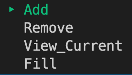
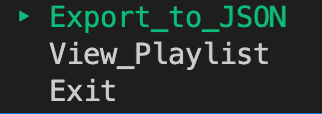

# README.

## Set List Generator - A Terminal Application

---

[Github repo](https://github.com/dallencode/setlist-app)

## Features

This application is designed for gigging musicians to create interesting and unique playlists for each performance. Built with the Ruby programming language, the app offers users the ability to:

- Check if user has visited before
- Select the desired number of songs in the set
- Add/Remove songs
- Fill the remaining playlist from a 'starter playlist' containing some of the most common songs to play at gigs
- Export/save the playlist to JSON file

**Feature - Choose Number of Songs**  
There are two ways of selecting the number of desired songs in the set list.  
The first option involves a slider prompt from the 'tty-prompt' gem. The user selects the number of songs (maximum is set at 20), the value of which is then used in a conditional loop to ensure the user doesn't add more songs than are allowed. The second option to enter the number of songs is to pass in the value as a command line argument.

**Feature - Add/Remove Songs**  
Again using tty-prompt, the user can select from a menu of options including add or remove songs.
To add a song, the user enters the title and artist which is then passed as a hash into an array holding the full list of added songs. To remove songs, the user enters the title which is then check against the array and deleted if it exists.

**Feature - Fill Playlist**  
Once the user has entered songs to include, they can choose to fill the remaining spots from the provided starter playlist. This function opens the starter playlist JSON file, compares the user's chosen songs with those in the file, checking/removing any doubles and fills the remaining spots with a random selection.

**Feature - Export**  
Using the name entered by the user at runtime, a file is created (or found if it already exists). If the option to export the playlist is chosen, this file is opened and the contents of the final setlist array is added.

## Help Documentation

### Install

To use this program, you will need to have ruby installed on your system. Please visit this [link](https://www.ruby-lang.org/en/documentation/installation/) for more information on installing ruby.

To install required dependencies and run the program, open the terminal and enter the following command:  
`./run_app.sh`

The application also accepts up to two command line arguments, however it can run without these. To speed up usage, you may enter your name and the number of songs in the set like so:
`./run_app.sh John 10`

Alternatively, run the following commands in order:  
`bundle install`  
`ruby generator.rb`

This application imports following ruby gems:

- tty-prompt
- colorize
- json
- rspec
- tty-file
- combine_pdf (no longer used)

## Usage

If no command line arguments are entered upon running the program, you will be asked for your name and how many songs are to be added to the playlist.

Much of this app is controlled using a menu. Use up/down arrows and the enter key to make selections.

Select `Add` or `Remove` to add or remove a song of your choice to the set list.

Select `View_Current` to see the progress of your set list.

Select `Fill` to finish filling up your setlist from the starter playlist.

Following these selections a second menu becomes available.

These options include Exporting the playlist to be saved in a JSON file, viewing the final playlist or exiting the program.

## Implementation

Much of this application was guided by the principles of Test Driven Development.
Each feature was built by first writing a simple test and then writing code that could pass the test. The cycle for each test and code iteration ranged from 30-60 minutes.

### Project Management

Trello was used to manage the flow of this project.

    
View screenshots

  
  
  

View the trello board [HERE](https://trello.com/b/lqRJUsOw/terminal-app) (note: you will need a free Trello account)

### Style Guide

Styling is based on the conventions outlined in [this style guide](https://github.com/rubocop/ruby-style-guide)

'Rubocop' is used to ensure styling is consistent.

ASCII art provided by [ASCII Art](https://www.asciiart.eu/)
